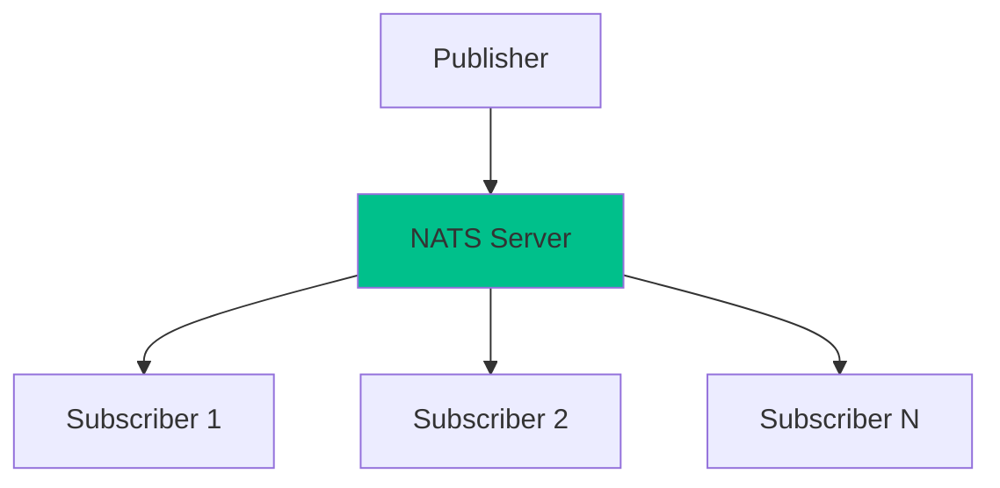
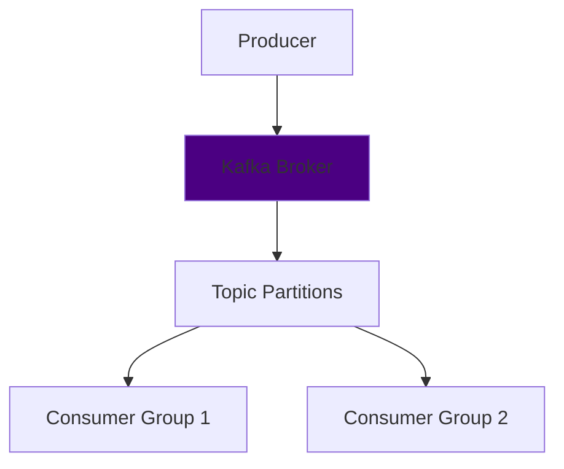

# NATS vs Kafka: A Modern Messaging System Comparison


## 🚀 Quick Overview

| Feature | NATS | Kafka |
|---------|------|-------|
| Primary Use Case | Real-time messaging | Stream processing |
| Latency | Microseconds | Milliseconds |
| Persistence | Optional (JetStream) | Default |
| Scaling | Simple clustering | Partition-based |
| Dependencies | None | ZooKeeper (legacy) |
| Learning Curve | Gentle | Steep |

## 🏗️ Core Architecture

### NATS: The Cloud-Native Messenger



NATS embraces simplicity with:

* ⚡ Lightning-fast pub-sub messaging
* 🔄 Built-in service discovery
* 🌐 Clustered deployment ready
* 📦 Optional persistence via JetStream
* 🔒 Security-first design

### Kafka: The Streaming Powerhouse



Kafka's architecture focuses on:

* 📝 Distributed commit log
* 🔀 Partition-based processing
* 👥 Consumer group scalability
* 💾 Guaranteed persistence
* 🔍 Strict ordering guarantees

## 💡 When to Choose What?

### Choose NATS When You Need:

```markdown
🎯 Real-time Communications
├── Microservices messaging
├── IoT device communication
├── Gaming applications
└── Service mesh implementation
```

### Choose Kafka When You Need:

```markdown
📊 Data Processing
├── Log aggregation
├── Stream processing
├── Event sourcing
└── Analytics platforms
```

## 🔧 Implementation Examples

### NATS Example

```go
// Connect to NATS
nc, err := nats.Connect("nats://localhost:4222",
    nats.Name("NATS Sample"),
    nats.MaxReconnects(-1))
if err != nil {
    log.Fatal(err)
}
defer nc.Close()

// Simple Publisher
nc.Publish("orders.new", []byte("New order received"))

// Subscriber with Queue Group
nc.QueueSubscribe("orders.*", "order-processors", func(msg *nats.Msg) {
    log.Printf("Received: %s\n", string(msg.Data))
})
```

### Kafka Example

```java
Properties props = new Properties();
props.put("bootstrap.servers", "localhost:9092");
props.put("key.serializer", "org.apache.kafka.common.serialization.StringSerializer");
props.put("value.serializer", "org.apache.kafka.common.serialization.StringSerializer");

Producer<String, String> producer = new KafkaProducer<>(props);
producer.send(new ProducerRecord<>("orders", "key", "value"));
```

## 📈 Performance Characteristics

### NATS Performance Profile

* Throughput: 🚀🚀🚀🚀
* Latency: ⚡⚡⚡⚡⚡
* Resource Usage: 💾💾
* Scalability: 📈📈📈📈
* Ease of Operation: 🛠️🛠️🛠️🛠️🛠️

### Kafka Performance Profile

* Throughput: 🚀🚀🚀🚀🚀
* Latency: ⚡⚡⚡
* Resource Usage: 💾💾💾💾
* Scalability: 📈📈📈📈📈
* Ease of Operation: 🛠️🛠️🛠️

## 🔄 Migration Strategy

1. **Assessment**
   * Map current message patterns
   * Analyze throughput needs
   * Document persistence requirements
   * Identify critical paths

2. **Implementation**
   * Deploy new infrastructure
   * Develop compatibility layer
   * Implement new patterns
   * Set up monitoring

3. **Migration**
   * Start with non-critical services
   * Run systems in parallel
   * Monitor performance
   * Gradual cutover

## 🎯 Best Practices

### NATS Best Practices

* Use subject hierarchies wisely (`org.department.service.*`)
* Implement proper error handling
* Set up monitoring and alerting
* Use queue groups for load balancing
* Consider JetStream for persistence needs

### Kafka Best Practices

* Plan partition strategy carefully
* Set appropriate retention policies
* Monitor consumer lag
* Use compression for efficiency
* Implement proper error handling

## 📚 Resources

* [NATS Documentation](https://docs.nats.io/)
* [Kafka Documentation](https://kafka.apache.org/documentation/)
* [NATS GitHub](https://github.com/nats-io)
* [Kafka GitHub](https://github.com/apache/kafka)

## 🎉 Conclusion

Both NATS and Kafka excel in their respective domains:

* **NATS** shines in cloud-native, real-time messaging scenarios
* **Kafka** dominates in high-throughput data streaming applications

Choose based on your specific needs, considering:

* Latency requirements
* Throughput needs
* Operational complexity
* Team expertise
* Infrastructure costs
